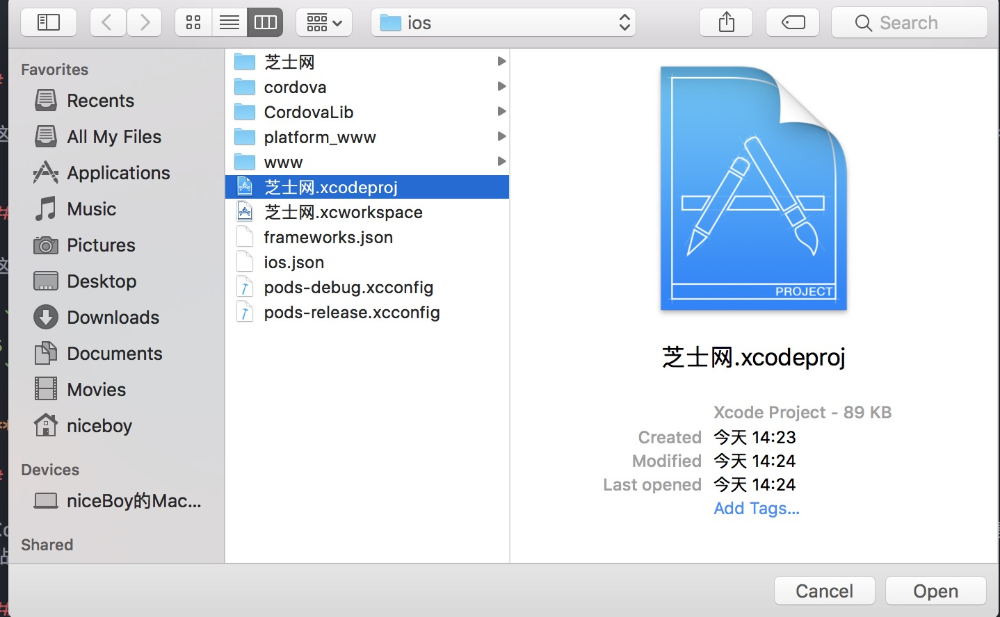
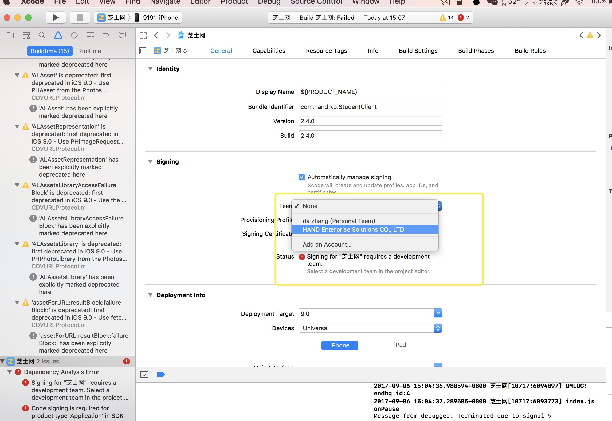

# Cordova的安装

- <http://cordova.apache.org/#getstarted>

## 1.安装cordova

```
npm install -g cordova
或者
npm i -g cordova（i 表示install）
```

## 2.添加cordova插件

```
$ cordova plugin add cordova-plugin-camera
Fetching plugin "cordova-plugin-camera@~2.1.0" via npm
Installing "cordova-plugin-camera" for android
Installing "cordova-plugin-camera" for ios
```

### 罗列已安装插件

```
cordova plugin ls
```

## 3.添加开发平台

```
1.cordova platform rm ios/andriod
2.cordova platform add ios/android
```

### 罗列已安装开发平台

```
cordova plaform ls
```

## 4.打包cordova 应用

### android系统

```
1.cordova prepare ios/android
2.//cordova build ios/android
```

### Ios系统（使用Xcode打包）

在cordova platform add ios 后打开Xcode



注意选择team为HAND



and


## #.Tips

如果有错误信息，以下是一些通用的解决方法(不一定管用)

```
cordova clean （清理项目）
cordova platform rm ios/android （重现添加平台）
cordova platform add ios/android
```
