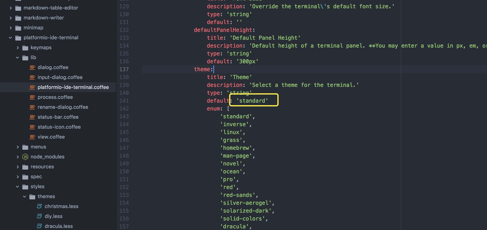
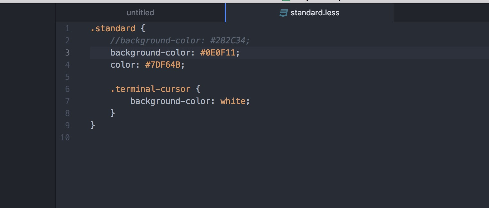
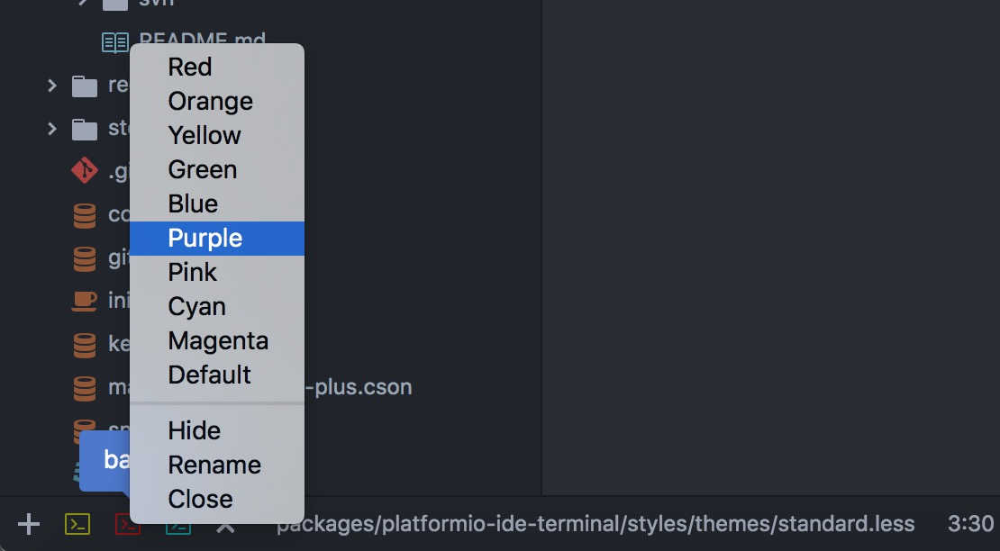

# atom中一些实用的插件

## Learn more here

[Packages make Atom do amazing things](https://atom.io/packages)

[ATOM基础教程一ATOM插件推荐(4)](http://blog.csdn.net/zsl10/article/details/51822715)

## Some useful points

### vim-mode-plus

(安装了vim-mode-plus不能编辑的问题)

有了 vim-mode 一定要装 ex-mode 和 relative-numbers 插件

### minimap

atom右上角的小地图,让你了解当前屏幕所处相对位置.

### File Icons

工程文件图标样式

### highlight-selected

单词选择高亮(相同的也高亮)

### merge-conflicts

直接用atom解决代码冲突

### git-log

展示工程在git上面提交的日志

```
Cmd-Shift-P  //打开日志面板
```

### ~~terminal-plus~~ (platformio-ide-terminal)

~~terminal-plus~~ 插件在mac上面无法输入命令，安装了node-gyp也不行(是个bug)，所以用`platformio-ide-terminal`替代

<https://atom.io/packages/platformio-ide-terminal>

atom内部的一个控制台,可以完全弃用系统控制台

```
cmd-shift-t //创建一个新的控制台
ctrl+`      //打开/关闭控制台
cmd-shift-x  //关闭当前打开的控制台
```

### terminal控制台样式设置

设置文字和背景





打开多个控制台还可以用命名和颜色区分哈



### svn

Marks lines/files in the editor gutter/treeview that have been added, edited, or deleted since the last commit.

#### mac上面暂时没有找到可以使用的svn插件，atom配合cornerstone使用吧

### autocomplete-paths

文件路径自动提示

### atom-beautify

代码格式化

### activate-power-mode

在编辑过程中保持一定的速度，会有一个绚丽的动画效果

### Emmet

(前身为 Zen Coding) 是一个能大幅度提高前端开发效率的工具，能够实现 HTML、CSS 的快速编写。

[简单的使用样例](http://www.hangge.com/blog/cache/detail_1537.html)
